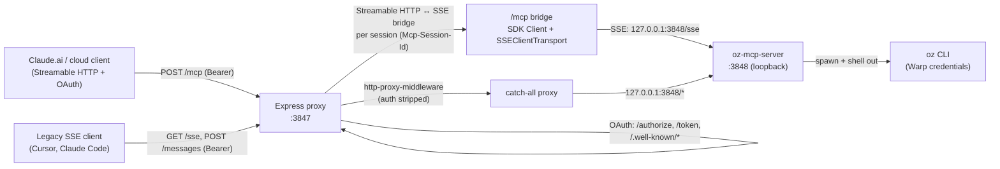

# OzBridge Remote

A deployable [Model Context Protocol](https://modelcontextprotocol.io) (MCP) server that exposes [Warp Oz](https://www.warp.dev/) agents to cloud AI surfaces — most notably **Claude.ai custom connectors** — over a public HTTPS endpoint. It wraps the standalone [`@sena-labs/oz-mcp-server`](https://github.com/sena-labs/OzBridge) (which only speaks the legacy HTTP+SSE transport on loopback) in an OAuth 2.1 proxy and adds a **Streamable HTTP `/mcp` endpoint** so spec-modern clients like Claude.ai can connect to it.

Deployed as a Dockerfile app on [Sevalla](https://sevalla.app), but the image runs anywhere that hosts Node containers (Fly.io, Render, Railway, a VPS, etc.).

> OzBridge Remote is an independent deployment wrapper. "Warp" and "Oz" are trademarks of Warp, Inc.; this project uses only Warp's documented public interfaces — the `oz` CLI and the MCP transport — and is not affiliated with, endorsed by, or sponsored by Warp.

---

## Table of contents

- [What it does](#what-it-does)
- [Architecture](#architecture)
- [How a request flows](#how-a-request-flows)
- [Transports: why two](#transports-why-two)
- [OAuth flow](#oauth-flow)
- [HTTP endpoints](#http-endpoints)
- [MCP tools exposed](#mcp-tools-exposed)
- [Environment variables](#environment-variables)
- [Deployment](#deployment)
- [Local development & testing](#local-development--testing)
- [Connecting Claude.ai](#connecting-claudeai)
- [Security considerations](#security-considerations)
- [Limitations & gotchas](#limitations--gotchas)

---

## What it does

Cloud AI GUIs (Claude.ai's "custom connector" feature) connect to remote MCP servers over the public internet using the **Streamable HTTP** transport and **OAuth 2.1** for authorization. The Oz agent toolset, however, is published by `@sena-labs/oz-mcp-server`, which:

- runs on `127.0.0.1` only (loopback, no TLS, no public auth),
- speaks the older **HTTP+SSE** transport (`GET /sse` + `POST /messages`),
- has no `/mcp` Streamable HTTP endpoint, and
- drives Oz by shelling out to the `oz` CLI, which needs your Warp credentials.

This server bridges that gap. One process:

1. **Spawns the internal `oz-mcp-server`** on a loopback port (`127.0.0.1:3848`), inheriting the host environment so the `oz` CLI can authenticate with your Warp account.
2. **Runs an Express HTTPS frontend** on `0.0.0.0:$PORT` (default `3847`) that:
   - implements a minimal OAuth 2.1 authorization server (fake, in-memory) so cloud clients can complete an authorization flow,
   - exposes `/mcp` as a Streamable HTTP endpoint that translates each downstream session into an upstream SSE connection to the internal server,
   - proxies every other authenticated path (`/sse`, `/messages`, `/health`, …) straight through to the internal server for legacy SSE clients.

The result: a single public URL (e.g. `https://ozbridge-mcp-aejjk.sevalla.app/mcp`) that Claude.ai can add as a custom connector, authenticate against, and then drive your Warp Oz agents — run agents, send follow-ups to runs, list runs, poll status, switch models — from inside Claude.

---

## Architecture



Key components in `server.js`:

- **OAuth layer** — `/.well-known/oauth-protected-resource`, `/.well-known/oauth-authorization-server`, `GET /authorize`, `POST /token`, and the `checkAuth` bearer middleware. All state (codes, tokens) is in-memory `Map`s.
- **`/mcp` Streamable HTTP bridge** — registered before the catch-all proxy. For each `initialize` it creates a `@modelcontextprotocol/sdk` `Client` over an `SSEClientTransport` pointed at the internal `/sse`, plus a forwarding `Server` on a `StreamableHTTPServerTransport` that hands out `Mcp-Session-Id` values.
- **Proxy-owned tools & REST endpoints** — the forwarding `Server` intercepts `tools/list` and `tools/call` to inject `oz_list_environments`, reimplement `oz_list_models` in-process (shelling out to `oz` directly), and reject `oz_agent_run` / `oz_agent_run_cloud` calls missing the required `model` (and `environment` for cloud) before forwarding to the internal server. `GET /environments` and `GET /models` expose the same listings as Bearer-authed JSON endpoints.
- **Catch-all SSE proxy** — `http-proxy-middleware` → `127.0.0.1:3848`, with `Authorization` stripped (the internal server is unauthenticated loopback). Keeps legacy SSE clients working.
- **Child process** — `spawn("node", [oz-mcp-server])` with `OZ_MCP_PORT=3848`, `OZ_MCP_BIND=127.0.0.1`, inheriting `process.env` so `WARP_API_KEY` / `OZ_*` vars reach the `oz` CLI. If the child exits, the proxy exits too.

---

## How a request flows

**A new Streamable HTTP session (Claude.ai):**

1. Client hits `POST /mcp` with a JSON-RPC `initialize` and no `Mcp-Session-Id`.
2. `checkAuth` validates the Bearer token (issued earlier via OAuth).
3. The bridge opens an `SSEClientTransport` to `http://127.0.0.1:3848/sse`, waits for the upstream `endpoint` event, and builds a forwarding `Server`.
4. A `StreamableHTTPServerTransport` generates a session id; `onsessioninitialized` stores `{ server, transport, client, timer }` in the `mcpSessions` map and arms a 30-min idle timer.
5. The SDK writes the `InitializeResult` back to the client as an SSE frame with an `mcp-session-id` response header.

**Subsequent requests on the same session:**

1. Client sends `POST /mcp` with `Mcp-Session-Id: <id>`.
2. The bridge looks up the session, refreshes its idle timer, and delegates to that session's `transport.handleRequest(req, res, req.body)`.
3. The SDK routes JSON-RPC requests to the forwarding `Server`, which calls `client.listTools()` / `client.callTool()` / `client.ping()` over the upstream SSE connection and streams the response back.
4. Notifications (e.g. `notifications/initialized`) get `202 Accepted`; requests get either `application/json` or `text/event-stream` depending on what the SDK chooses.

**Teardown / expiry:**

- `DELETE /mcp` with the session id closes the upstream client + transport and removes the session.
- The idle timer closes the session after `MCP_IDLE_TIMEOUT_MS` (default 30 min) of inactivity. The next request from the client then gets `404 Session not found`, which per the MCP spec tells the client to send a fresh `initialize`.

**A legacy SSE client (Cursor, Claude Code CLI):**

1. Client completes the same OAuth flow, then `GET /sse` with the Bearer.
2. `checkAuth` passes; the catch-all proxy forwards to `127.0.0.1:3848/sse`.
3. The internal server streams the `endpoint` event; the client POSTs JSON-RPC to `/messages?sessionId=…`, which is also proxied straight through.

---

## Transports: why two

The MCP spec evolved from **HTTP+SSE** (two endpoints: `GET /sse` for the stream, `POST /messages` for requests) to **Streamable HTTP** (one endpoint, conventionally `/mcp`, handling `POST`/`GET`/`DELETE` with optional SSE response streaming). Claude.ai's connector uses Streamable HTTP and probes the registered URL with `POST initialize`.

The upstream `@sena-labs/oz-mcp-server` only implements the **legacy** transport — its routes are `GET /sse`, `POST /messages?sessionId=`, `GET /health`, and nothing else. Before this server added `/mcp`, Claude.ai's post-OAuth `POST initialize` hit the upstream's `404 {"error":"not_found"}` and Claude reported *"no MCP server was found at the provided URL."*

The `/mcp` bridge fixes that by speaking Streamable HTTP to the cloud and SSE to the internal server, while the catch-all proxy preserves the legacy SSE paths for clients that still prefer them.

---

## OAuth flow

This is a **fake, in-memory OAuth 2.1 server** — enough for cloud GUIs to complete authorization. There is no user login; the "client secret" is a shared bearer (`MCP_BEARER_TOKEN`). It supports PKCE `S256` and refresh tokens.

1. **Discovery** — Claude.ai fetches `/.well-known/oauth-protected-resource` and `/.well-known/oauth-authorization-server`. The `WWW-Authenticate` header on every `401` points back to the protected-resource metadata.
2. **Authorize** — `GET /authorize?response_type=code&client_id=…&redirect_uri=…&code_challenge=…&code_challenge_method=S256&state=…`. The only accepted `redirect_uri` is `https://claude.ai/api/mcp/auth_callback` (hardcoded). A code + token pair is minted and stored (code valid 10 min); the browser is redirected to the callback with the code.
3. **Token** — `POST /token` with `grant_type=authorization_code`, the `code`, `client_id`, `client_secret` (must equal `MCP_BEARER_TOKEN`), and `code_verifier` (verified against the stored `code_challenge` when PKCE was used). On success it returns `{ access_token, token_type: "Bearer", expires_in: 3600, refresh_token, scope: "mcp" }`. `grant_type=refresh_token` issues a fresh token without re-checking the secret.
4. **Access** — Every MCP/SSE request must carry `Authorization: Bearer <access_token>`. `checkAuth` validates the token against the in-memory `tokens` map and its 1-hour expiry; failures return `401` with a `WWW-Authenticate` `resource_metadata` pointer so Claude can restart discovery.

The metadata does **not** currently advertise a `registration_endpoint` (Dynamic Client Registration), so Claude.ai's default "Add connector" flow expects pre-registered credentials — see [Connecting Claude.ai](#connecting-claudeai).

---

## HTTP endpoints

| Method | Path | Auth | Purpose |
| --- | --- | --- | --- |
| `GET` | `/.well-known/oauth-protected-resource` | none | RFC 9728 protected-resource metadata (`resource`, `authorization_servers`, `bearer_methods_supported`). |
| `GET` | `/.well-known/oauth-authorization-server` | none | RFC 8414 authorization-server metadata (endpoints, grant types, PKCE, scopes). |
| `GET` | `/authorize` | none | Authorization endpoint. Validates `redirect_uri` (Claude.ai callback only), mints a code, 302-redirects. |
| `POST` | `/token` | client_secret | Token endpoint. `authorization_code` (validates secret + PKCE) and `refresh_token` grants. |
| `OPTIONS` | `/mcp` | none | CORS preflight → `204`. |
| `POST` | `/mcp` | Bearer | Streamable HTTP MCP endpoint. `initialize` starts a session; all later requests carry `Mcp-Session-Id`. |
| `GET` | `/mcp` | Bearer | `405 Method Not Allowed` (server-initiated streams not offered). |
| `DELETE` | `/mcp` | Bearer | Terminates the session named by `Mcp-Session-Id` → `200`. |
| `GET` | `/sse` | Bearer | *(proxied)* Legacy SSE stream; first frame is `event: endpoint` with the upstream `sessionId`. |
| `POST` | `/messages?sessionId=…` | Bearer | *(proxied)* Legacy SSE JSON-RPC POST; ack `202`, response streams over `/sse`. |
| `GET` | `/health` | Bearer | *(proxied)* Internal health: `{"ok":true,"name":"oz-mcp-server","version":"…","tools":6,"sessions":N}`. |
| `GET` | `/environments` | Bearer | List cloud Oz environments: `{"count":N,"environments":[…]}` (from `oz environment list`). |
| `GET` | `/models` | Bearer | List available Oz models: `{"count":N,"current":"…","recommended":"…","models":[…]}` (from `oz model list`). `recommended` is the suggested model (default `kimi-k26-fireworks`, overridable via `OZ_RECOMMENDED_MODEL`). |
| `POST` | `/runs/:runId/followups` | Bearer | Send a follow-up message to an existing Oz run via the Warp public API (in-process, not proxied). JSON body: `{"message":"…"}`. Returns `{"accepted":true}` on success. |
| `*` | `/*` | Bearer | *(proxied)* Anything else authenticated falls through to the internal server. |

CORS on `/mcp`: `Access-Control-Allow-Origin: *`, `Allow-Methods: GET, POST, DELETE, OPTIONS`, `Allow-Headers` includes `Content-Type, Authorization, Accept, Mcp-Session-Id, MCP-Protocol-Version, Last-Event-ID`, and `Expose-Headers: Mcp-Session-Id`.

JSON-RPC error responses follow the spec: `400` for a non-`initialize` POST with no session id, `404` for an unknown session id, `401` for a missing/expired token, `405` for `GET /mcp`, `502` if the upstream SSE server can't be reached, `503` if the session cap is hit.

---

## MCP tools exposed

The internal `@sena-labs/oz-mcp-server` contributes the run/read tools; the proxy layer in `server.js` injects `oz_list_environments`, reimplements `oz_list_models` in-process, enforces required `model` (both run tools) and `environment` (cloud runs only) before forwarding, and implements `oz_run_followup` in-process via the Warp public API (the `oz` CLI has no follow-up command). `tools/list` reports 8 tools. The `oz` CLI must be authenticated (`WARP_API_KEY` or `oz login`) for any of them to return real data, and `oz_run_followup` additionally requires `WARP_API_KEY` to be set (it calls the REST API directly).

| Tool | Mode | Description |
| --- | --- | --- |
| `oz_agent_run` | local | Run a Warp Oz agent locally (`oz agent run`) with a prompt. **`model` is required.** Params: `prompt` (required), `model` (**required**), `profile`, `skill`. Returns the full run payload. |
| `oz_agent_run_cloud` | cloud | Launch a cloud Oz agent. **Consumes Warp credits.** **`model` and `environment` are both required.** Returns a run id immediately; poll with `oz_run_get`. Params: `prompt` (required), `model` (**required**), `environment` (**required**), `skill`. |
| `oz_run_get` | read-only | Fetch a run's status and output by id. Params: `runId` (required). |
| `oz_run_list` | read-only | List recent runs, filterable by status (`all` / `active` / `completed` / raw statuses). Params: `status`, `limit`. |
| `oz_run_followup` | write | Send a follow-up message to an existing run (queued, in progress, or ended). Implemented in-process via the Warp public API (`POST /agent/runs/{runId}/followups`); requires `WARP_API_KEY`. Params: `runId` (required), `message` (required). Returns `{ accepted: true }` on success; poll `oz_run_get` for updated state. |
| `oz_list_environments` | read-only | List the cloud environments available to the account (`oz environment list`). No params. Also exposed as `GET /environments`. |
| `oz_list_models` | read-only | List the AI model ids available to the account (`oz model list`), the current default, and the recommended model. No params. Also exposed as `GET /models`. |
| `oz_set_default_model` | write | Set the default Oz model by writing `defaultModel` into the workspace `.warp/warp-bridge.yaml`. Params: `model` (required, e.g. `claude-4-8-opus-max` or `auto`). |

Full JSON `inputSchema`s are returned by `tools/list`.

---

## Environment variables

Runtime configuration is entirely env-based. Copy `.env.example` to `.env` for local work; in production set them in the hosting platform's dashboard.

| Variable | Required | Default | Purpose |
| --- | --- | --- | --- |
| `MCP_BEARER_TOKEN` | **yes** | — | Shared secret used as the OAuth `client_secret` at `/token`. Generate a long random string. |
| `WARP_API_KEY` | **yes** | — | Credentials the spawned `oz` CLI uses to authenticate to Warp. Required for the tools to return real data. |
| `BASE_URL` | recommended | derived | Public origin advertised in OAuth metadata (`https://your-app.example.com`). When unset, derived from `x-forwarded-proto` / `x-forwarded-host` / `Host` headers. Set it explicitly in production behind a proxy/CDN. |
| `PORT` | no | `3847` | Port the Express proxy listens on (must match `EXPOSE` / the host's routing). |
| `NODE_ENV` | no | — | Set to `production` in deployments. |
| `MCP_IDLE_TIMEOUT_MS` | no | `1800000` (30 min) | Per-session idle timeout before the `/mcp` bridge closes the upstream SSE client. |
| `MCP_MAX_SESSIONS` | no | `100` | Cap on concurrent `/mcp` sessions; beyond it, new `initialize` requests get `503`. |
| `OZ_PATH` | no | `oz` | Path to the `oz` CLI binary (passed through to the child). |
| `OZ_DEFAULT_MODEL` | no | `auto` | Default AI model for runs (passed through to the child). |
| `OZ_DEFAULT_PROFILE` | no | `Default` | Default Oz agent profile (passed through). |
| `OZ_TIMEOUT_MS` | no | `300000` | Hard timeout for local runs in ms (passed through). |
| `OZ_IDLE_TIMEOUT_MS` | no | `90000` | Abort a local run after this long with no CLI output (passed through). |
| `OZ_LIST_TIMEOUT_MS` | no | `30000` | Hard timeout (ms) for the proxy's own `oz environment list` / `oz model list` calls backing the listing tools, `GET /environments` / `GET /models`, and the direct Oz API followup POST (`oz_run_followup` / `POST /runs/:runId/followups`). |
| `OZ_RECOMMENDED_MODEL` | no | `kimi-k26-fireworks` | Model id advertised as `recommended` in the `oz_list_models` tool and `GET /models` output. Override to point clients at a different suggested model. |
| `OZ_API_BASE_URL` | no | `https://app.warp.dev/api/v1` | Base URL of the Warp public API used by the in-process `oz_run_followup` tool and `POST /runs/:runId/followups` endpoint. Override to point at staging. |

> The internal port `3848` is fixed in code and bound to `127.0.0.1` only; it is not configurable and never exposed publicly.

---

## Deployment

### Dockerfile (what gets built)

The included `Dockerfile`:

1. Starts from `node:22-slim`.
2. Installs `curl`, `gpg`, `ca-certificates`.
3. Adds Warp's apt repository and installs `oz-stable` (the `oz` CLI).
4. Copies `package*.json`, runs `npm install --production`, copies the app.
5. Exposes `3847` and runs `npm start` (`node server.js`).

The image is self-contained: Node + the oz CLI + the proxy. No external `oz` install is needed on the host.

### Sevalla

This app is deployed on Sevalla as a **Dockerfile** app sourced from a public Git repo, with manual deploys (auto-deploy off). To deploy or update:

1. Push to the repo's default branch (`main`).
2. Trigger a deployment via the Sevalla dashboard or API (`POST /applications/{id}/deployments` with `{"branch":"main"}`).
3. Set the runtime env vars (`MCP_BEARER_TOKEN`, `WARP_API_KEY`, `BASE_URL`, `NODE_ENV`) in the Sevalla application settings — they are injected into the container and inherited by the `oz` CLI child.
4. Sevalla terminates TLS and routes `https://<app>.sevalla.app` to container port `3847`.

### Other hosts

Any platform that builds a Dockerfile and routes HTTPS to port `3847` works. Make sure long-lived SSE responses aren't buffered by an upstream proxy (see [Limitations](#limitations--gotchas)).

---

## Local development & testing

```bash
cp .env.example .env
# edit .env: set MCP_BEARER_TOKEN to a long random string
#           set WARP_API_KEY to your Warp API key
npm install
npm start
```

The proxy listens on `http://0.0.0.0:3847` and the internal server on `http://127.0.0.1:3848`. For a public URL during local testing, tunnel port `3847` (e.g. `cloudflared tunnel --url http://localhost:3847`) and set `BASE_URL` to the tunnel URL so OAuth metadata advertises the right origin.

Smoke-test the full flow (OAuth → Streamable HTTP):

```bash
BASE=http://127.0.0.1:3847
SECRET=<your MCP_BEARER_TOKEN>

# 1. authorize (captures the code from the redirect Location)
CODE=$(curl -sS -i --max-redirs 0 \
  "$BASE/authorize?response_type=code&client_id=t&redirect_uri=https%3A%2F%2Fclaude.ai%2Fapi%2Fmcp%2Fauth_callback&state=x" \
  | grep -i '^location:' | grep -oE 'code=[^&]+' | cut -d= -f2)

# 2. exchange for an access token
ACCESS=$(curl -sS -X POST "$BASE/token" \
  -H "Content-Type: application/x-www-form-urlencoded" \
  --data-urlencode "grant_type=authorization_code" --data-urlencode "code=$CODE" \
  --data-urlencode "redirect_uri=https://claude.ai/api/mcp/auth_callback" \
  --data-urlencode "client_id=t" --data-urlencode "client_secret=$SECRET" \
  | grep -oE '"access_token":"[^"]+"' | cut -d'"' -f4)

# 3. initialize a Streamable HTTP session (returns mcp-session-id + serverInfo)
curl -sS -i -X POST "$BASE/mcp" \
  -H "Authorization: Bearer $ACCESS" \
  -H "Content-Type: application/json" \
  -H "Accept: application/json, text/event-stream" \
  -d '{"jsonrpc":"2.0","id":1,"method":"initialize","params":{"protocolVersion":"2025-06-18","capabilities":{},"clientInfo":{"name":"test","version":"1.0"}}}'

# 4. with the returned Mcp-Session-Id, list tools (expect all 6)
curl -sS -X POST "$BASE/mcp" \
  -H "Authorization: Bearer $ACCESS" -H "Content-Type: application/json" \
  -H "Accept: application/json, text/event-stream" \
  -H "Mcp-Session-Id: <session-id>" -H "MCP-Protocol-Version: 2025-06-18" \
  -d '{"jsonrpc":"2.0","id":2,"method":"tools/list","params":{}}'
```

For an interactive spec check, run the official inspector against `http://localhost:3847/mcp` (provide the Bearer token):

```bash
npx @modelcontextprotocol/inspector
```

---

## Connecting Claude.ai

1. Go to **Settings → Connectors → Add custom connector**.
2. Enter the server URL: `https://<your-app>.sevalla.app/mcp` (the `/mcp` path is required — the bare URL or `/sse` will not satisfy Claude.ai's Streamable HTTP probe).
3. Because this server's OAuth metadata does not advertise Dynamic Client Registration, use **Advanced settings** and provide:
   - **Client ID:** any non-empty string (e.g. `ozbridge`) — `/authorize` accepts any `client_id`.
   - **Client secret:** your `MCP_BEARER_TOKEN` value — `/token` validates it.
4. Authorize. Claude.ai completes the OAuth flow and issues a bearer; on success it sends `POST /mcp` `initialize`, lists tools, and the 8 `oz_*` tools become available in chat.

If you'd rather avoid entering credentials manually, a fake DCR `/register` endpoint can be added (returning a fixed `client_id` / `client_secret` and a `registration_endpoint` in the AS metadata) so the default no-credentials flow works — not currently implemented.

---

## Security considerations

- **`MCP_BEARER_TOKEN` is the only client secret.** Anyone who has it can mint access tokens. Treat it like a credential, rotate it, and never commit it. `.env` is gitignored.
- **`WARP_API_KEY` grants Oz agent execution** — including `oz_agent_run` (local agent runs) and `oz_agent_run_cloud` (which spends Warp credits). Scope and protect it accordingly.
- **OAuth state is in-memory.** Codes, tokens, and `/mcp` sessions are lost on every restart/redeploy. Clients re-`initialize` on `404` per the MCP spec, and re-authorize when their token expires — this is expected, but means a redeploy logs out every connected client.
- **`redirect_uri` is pinned** to `https://claude.ai/api/mcp/auth_callback`, so authorization codes can only be sent back to Claude.ai. Other cloud clients would need this allowlist extended.
- **No TLS in-process.** The proxy speaks plain HTTP; TLS is terminated by the host (Sevalla/Cloudflare in production). Always expose it over HTTPS.
- **`/mcp` sessions open one upstream SSE connection each**, bounded by `MCP_MAX_SESSIONS` (default 100) and reaped after `MCP_IDLE_TIMEOUT_MS` (default 30 min).
- **CORS is `*`** on `/mcp` to support browser-based clients. Tighten the `Access-Control-Allow-Origin` in `setMcpCors()` if you want to restrict origins.

---

## Limitations & gotchas

- **Long-running tool calls.** `oz_agent_run` can run up to `OZ_TIMEOUT_MS` (default 5 min), matching Claude.ai's 300 s tool-result cap. The `/mcp` bridge streams responses as SSE; ensure your reverse proxy / CDN does **not** buffer or prematurely time out `text/event-stream` responses. Sevalla/Cloudflare already pass the legacy `/sse` stream through unbuffered, so the path is supported.
- **`SSEClientTransport` is marked legacy** in the MCP SDK, but it's required here because the upstream `oz-mcp-server` only exposes SSE. The public `/mcp` surface is fully Streamable HTTP; the legacy piece is internal only.
- **No prompts/resources.** The upstream server only implements tools, so the forwarding `Server` registers only `tools/list`, `tools/call`, and `ping` handlers.
- **`GET /mcp` returns `405`** (no server-initiated notification stream). Clients that rely on standalone `GET`-stream notifications won't get them; requests-only usage (Claude.ai's pattern) works fine.
- **Not affiliated with Warp.** This is a deployment wrapper around an independent community package (`@sena-labs/oz-mcp-server`) that shells out to the `oz` CLI. It does not modify or reverse-engineer Warp software.
